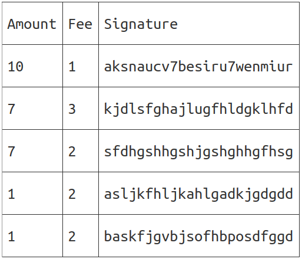
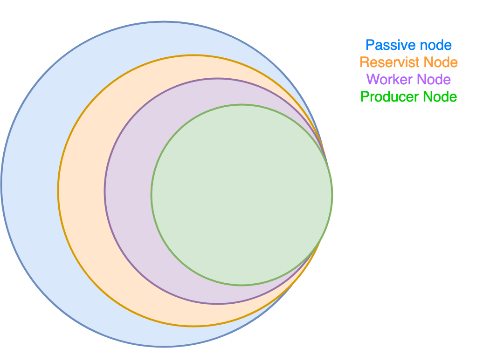
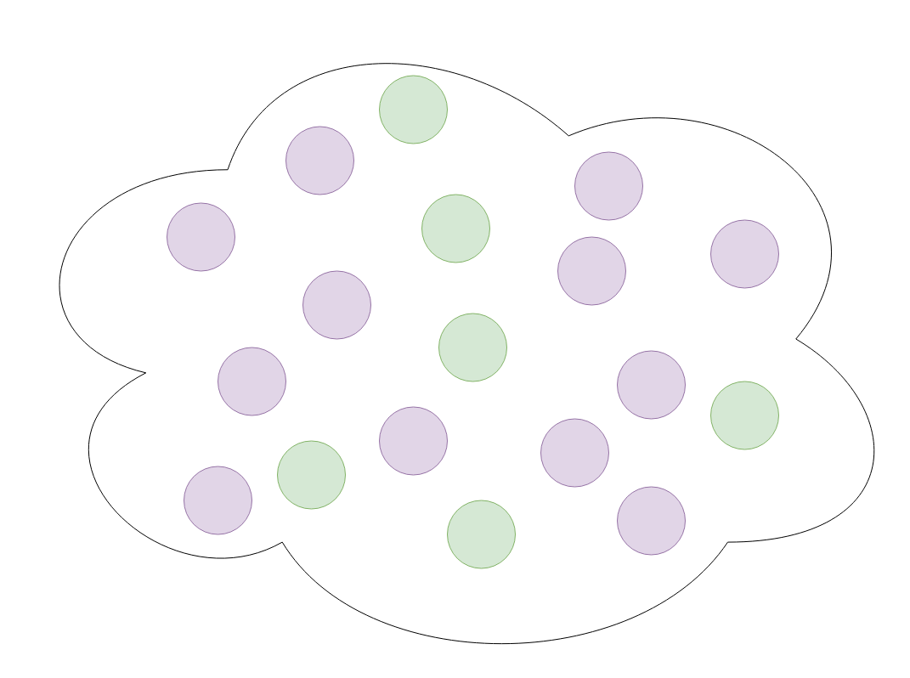
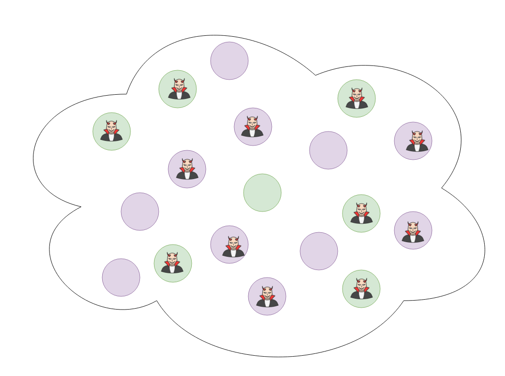
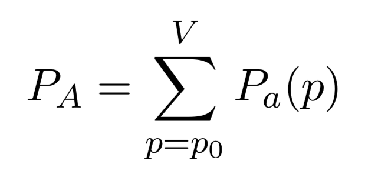
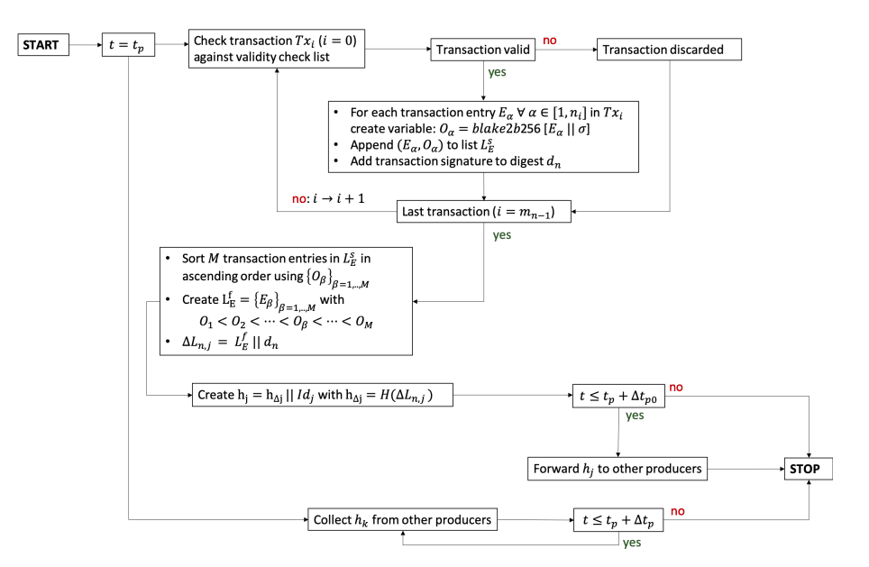

# Catalyst Network

Developer Introduction

###### Created by [@nshcore](https://github.com/nshcore/)


---

# What is the
# <!--fit-->Catalyst Network?

---

# <!--fit--> #NotHotDog


---

# Catalyst Network 

* Probabalistic BFT Consensus
* Distributed FileSystem (DFS)
* Distributed Compute System (DCS)
* Distributed DNS
* KVM smart contracts
* Public and Confidential transactions

---

# What is 
# <!--fit-->Probablistic BFT Consensus

---

# <!---fit--->A collabarative process in which nodes collectively vote on global state transitions

---
# Create Transaction
```
                                                                                                                   +--Confidential Entry-------------------+---------------+
+---Protocol Message-------------------------------------+-----------------+                                       |                                       |               |
|                                                        |                 |                                       |  value_commitment                     | M * 32 bytes  |
|   PeerID                                               | 60 bytes        |   +--Public Entry----+-----------+    |                                       |               |
|                                                        |                 |   |                  |           |    +-------------------------------------------------------+
+--------------------------------------------------------------------------+   |  Amount          |  32 bytes |    |                                       |               |
|                                                        |                 |   |                  |           |    |  bit_commitment                       | 32 bytes      |
|   CorrelationId                                        | 16 bytes        |   +------------------------------+    |                                       |               |
|                                                        |                 |   |                  |           |    +-------------------------------------------------------+
+--------------------------------------------------------------------------+   |  To Address      |  20 bytes |    |                                       |               |
|                                                        |                 |   |                  |           |    |  per_bit_blinding_factor_commitment   | 32 bytes      |
|   MessageType                                          | 2 bytes         |   +------------------------------+    |                                       |               |
|                                                        |                 |   |                  |           |    +-------------------------------------------------------+
+--------------------------------------------------------------------------+   |  From Address    |  20 bytes |    |                                       |               |
|                                                        |                 |   |                  |           |    |  poly_commitment_t1                   | 32 bytes      |
|   Signature                                            | 64 bytes        |   +------------------------------+    |                                       |               |
|                                                        |                 |   |                  |           |    +-------------------------------------------------------+
+--------------------------------------------------------------------------+   |  Transaction Fee |  32 bytes |    |                                       |               |
|--Transaction Message-----------------------------------------------------|   |                  |           |    |  poly_commitment_t2                   | 32 bytes      |
||                     |                                 |                ||   +------------------+-----------+    |                                       |               |
||                     |  Public Entries                 | N * 104 bytes  ||                                       +-------------------------------------------------------+
||                     |                                 |                ||   +--Contract Entry--+-----------+    |                                       |               |
||                     |                                 |                ||   |                  |           |    |  proof_of_share_tau                   | 32 bytes      |
||                     +---------------------------------------------------|   |  Amount          |  32 bytes |    |                                       |               |
||                     |                                 |                ||   |                  |           |    +-------------------------------------------------------+
||  Entries (N > 1)    |                                 |                ||   +------------------------------+    |                                       |               |
||                     |  Confidential Entries           | N * (104 bytes ||   |                  |           |    |  proof_of_share_mu                    | 32 bytes      |
||                     |                                 | + CallData)    ||   |  CallData        | Bytes > 0 |    |                                       |               |
||                     |                                 |                ||   |                  |           |    +-------------------------------------------------------+
||                     +---------------------------------------------------|   +------------------------------+    |                                       |               |
||                     |                                 |                ||   |                  |           |    |  aggregated_vector_polynomial_l       | k * 32 bytes  |
||                     |                                 |                ||   |  To Address      |  20 bytes |    |                                       |               |
||                     |  Smart Contract Entries         |  N*736 bytes   ||   |                  |           |    +-------------------------------------------------------+
||                     |                                 |                ||   +------------------------------+    |                                       |               |
||                     |                                 |                ||   |                  |           |    |  aggregated_vector_polynomial_r       | k * 32 bytes  |
|----------------------+---------------------------------------------------|   |  From Address    |  20 bytes |    |                                       |               |
||                                                       |                ||   |                  |           |    +-------------------------------------------------------+
||  Signature                                            |  64 bytes      ||   +------------------------------+    |                                       |               |
||                                                       |                ||   |                  |           |    |  a_prime_0                            | 32 bytes      |
|--------------------------------------------------------------------------|   |  Transaction Fee |  32 bytes |    |                                       |               |
||                                                       |                ||   |                  |           |    +-------------------------------------------------------+
||  Timestamp                                            |  4 bytes       ||   +------------------+-----------+    |                                       |               |
||                                                       |                ||                                       |  b_prime_0                            | 32 bytes      |
|--------------------------------------------------------------------------|                                       |                                       |               |
+--------------------------------------------------------------------------+                                       +---------------------------------------+---------------+

```

---

# Broadcast to network


---

# Nothing too strange yet

---

# Deterministic Mempool

- Highest amount
- Highest fee
- Oldest timestamp
- Signature in alphabetical order



---

# Validation

---

# Peers in the validation process have 4 states

1. Passive Node
    - Connected to peer network
2. Reservist Node
    - Awaiting for admission to the validation pool
3. Worker Node
    - A node that is admited to the validation pool
4. Producer Node
    - A subset of worker nodes who can contirbute to production of ledger state updates

---

# Producer Selection 

dfsHash(Δc-1) XOR PeerID

```
+----------------------+---------------------+----------------------+-----------------------+---------------------+----------------------+
|                      |                     |                      |                       |                     |                      |
|                      |                     |                      |                       |                     |                      |
|  dfsHash(Δc-1)       |  dfsHash(Δc-1)      |  dfsHash(Δc-1)       |  dfsHash(Δc-1)        |  dfsHash(Δc-1)      |  dfsHash(Δc-1)       |
|                      |                     |                      |                       |                     |                      |
|  cycle 2             |  cycle 3            |  cycle 4             |  cycle 5              |  cycle 6            |  cycle 7             |
|                      |                     |                      |                       |                     |                      |
+----------------------+---------------------+----------------------+-----------------------+---------------------+----------------------+

```

---

# Network Constitution


---

# Worker pool


---


# Worker pool


---

# Worker pool



---

# Evil Nodes


---

# Worker pool


---

# Worker pool


---

# Worker pool



---


---

# 51% Attack Research



# <!--fit--> http://github.com/catalyst-network/51-percent-attack-research


---

# The Ledger Cycle

- Producers validate common sets of transactions from the mempool

- Each producer compiles a state delta and votes among its peers in the cycle to vote on the most popular delta produced by the set of producers.

---

# The Ledger Cycle



---

# State Update

When producers have voted and come to consensus on the most correct state update, a state delta update is broadcast to the rest of the network

```
 message Delta {
	bytes previous_delta_dfs_hash = 1;
	bytes state_trie = 2;
	bytes receipt_trie = 3;
	google.protobuf.Timestamp time_stamp = 4;
	repeated Transaction.PublicEntry public_entries = 5;
	repeated Transaction.ConfidentialEntry confidential_entries = 6;
	repeated Transaction.ContractEntry contract_entries = 7;
	repeated Transaction.CoinbaseEntry coinbase_entries = 8;
}
```

Who then clean the validated tx's from their mempool

---

# #NotBlockchain


---

# #DeltaChain


---


---

# Consensus Research

# <!--fit--> https://catalystnet.org/consensus-research-paper.pdf


---

# Architecture

```
+---------------------------+--------------------------+
|                           |                          |
|                           |                          |
|     Catalyst.Modules      |     Custom.Modules.*     |
|                           |                          |
+---------------------------+--------------------------+
|                                                      |
|                                                      |
|     Catalyst.Core.Modules.*                          |
|                                                      |
+------------------------------------------------------+
|                                                      |
|                                                      |
|     Catalyst.Core.Lib                                |
|                                                      |
+--------------------------------------------------------------------------------+----------------------------+
|                                                      |                         |                            |
|                                                      |                         |                            |
|     Protocol.Sdk.C#                                  |     Protocol.Sdk.Js     |     Protocol.Sdk.Java      |
|                                                      |                         |                            |
+------------------------------------------------------+-------------------------+----------------------------+
|                                                                                                             |
|                                                                                                             |
|     Catalyst.Protocol                                                                                       |
|                                                                                                             |
+-------------------------------------------------------------------------------------------------------------+
```

---

# Catalyst.Protocol

* Abstract Protocol Schema Deffinitions.
* Protobuffs Serialisation Format.
* Language Interoperability.

---

# Protocol-sdk-*

* Concrete standardised types across languages
* Auto generated from protobuffs deffinitions
* Building blocks for low level functionality

---

# Catalyst.Core.Lib

Core librarys and helpers for IO, networking and configuration. Low level functionality for nodes and modules

* IO
* P2P
* Cryptography

---

# Catalyst.Core.Modules.*

* Core modules provide spoecific functionality for Catalyst.Node

---

# Catalyst.Modules.*

* Modules provide 'flavour' functionality for nodes
* Use familiar technology
* Extend core functionality

```
+-+Catalyst.Core.Module.*+---------------------------------------------------------------------------------------------------------------------+
|                                                                                                                                              |
|  +-------------+ +-------------+ +---------------+ +---------------+ +---------------+ +---------------+ +---------------+ +---------------+ |
|  |             | |             | |               | |               | |               | |               | |               | |               | |
|  |             | |             | |               | |               | |               | |               | |               | |               | |
|  |             | |             | |               | |               | |               | |               | |               | |               | |
|  |             | |             | |               | |               | |               | |               | |               | |               | |
|  |             | |             | |               | |               | |               | |               | |               | |               | |
|  | KVM         | | Consensus   | | Ledger        | | Mempool       | | KeySigner     | | KeyStore      | | Cryptography  | | DFS           | |
|  |             | |             | |               | |               | |               | |               | |               | |               | |
|  |             | |             | |               | |               | |               | |               | |               | |               | |
|  |             | |             | |               | |               | |               | |               | |               | |               | |
|  |             | |             | |               | |               | |               | |               | |               | |               | |
|  |             | |             | |               | |               | |               | |               | |               | |               | |
|  +-------------+ +-------------+ +---------------+ +---------------+ +---------------+ +---------------+ +---------------+ +---------------+ |
|                                                                                                                                              |
+----------------------------------------------------------------------------------------------------------------------------------------------+

+----------------------------------------------------------------------------------------------------------------------------------------------+
|                                                                                                                                              |
|   Catalyst.Core.Lib                                                                                                                          |
|                                                                                                                                              |
+----------------------------------------------------------------------------------------------------------------------------------------------+

```
---

# Custom modules

Custom modules are a great way of providing additional or domain specific functionality to the node.

---

# Catalyst.Node.POA-CE

```
+--+Catalyst.Node.POA-CE+-------------------------------------------------------------------------------------------+
|                                                                                                                   |
|  +----------------+ +---------------+                                                                             |
|  |                | |               |                                                                             |
|  |                | |               |                                                                             |
|  | POA.Consensus  | | POA.Discovery |                                                                             |
|  |                | |               |                                                                             |
|  |                | |               |                                                                             |
|  |                | |               |                                                                             |
|  +----------------+ +---------------+                                                                             |
|                                                                                                                   |
| +--+Catalyst.Core.Modules+--------------------------------------------------------------------------------------+ |
| |                                                                                                               | |
| | +---------------+ +---------------+ +---------------+ +---------------+ +---------------+  +---------------+  | |
| | |               | |               | |               | |               | |               |  |               |  | |
| | |               | |               | |               | |               | |               |  |               |  | |
| | |               | |               | |               | |               | |               |  |               |  | |
| | |               | |               | |               | |               | |               |  |               |  | |
| | |               | |               | |               | |               | |               |  |               |  | |
| | | Ledger        | | Mempool       | | KeySigner     | | KeyStore      | | Cryptography  |  |  Dfs          |  | |
| | |               | |               | |               | |               | |               |  |               |  | |
| | |               | |               | |               | |               | |               |  |               |  | |
| | |               | |               | |               | |               | |               |  |               |  | |
| | |               | |               | |               | |               | |               |  |               |  | |
| | |               | |               | |               | |               | |               |  |               |  | |
| | +---------------+ +---------------+ +---------------+ +---------------+ +---------------+  +---------------+  | |
| |                                                                                                               | |
| +---------------------------------------------------------------------------------------------------------------+ |
|                                                                                                                   |
| +---------------------------------------------------------------------------------------------------------------+ |
| |                                                                                                               | |
| |  Catalyst.Core.Lib                                                                                            | |
| |                                                                                                               | |
| +---------------------------------------------------------------------------------------------------------------+ |
+-------------------------------------------------------------------------------------------------------------------+

```
---

# Catalyst.Node-CE

```
+--Catalyst.Node-CE--------------------------------------------------------------------------------------------------------------------------------+
| +---------------+ +---------------+  +---------------+                                                                                           |
| |               | |               |  |               |                                                                                           |
| |               | |               |  |               |                                                                                           |
| |               | |               |  |               |                                                                                           |
| |               | |               |  |               |                                                                                           |
| |               | |               |  |               |                                                                                           |
| | DCS           | | Web3          |  | DDNS          |                                                                                           |
| |               | |               |  |               |                                                                                           |
| |               | |               |  |               |                                                                                           |
| |               | |               |  |               |                                                                                           |
| |               | |               |  |               |                                                                                           |
| |               | |               |  |               |                                                                                           |
| +---------------+ +---------------+  +---------------+                                                                                           |
|                                                                                                                                                  |
| +-+Catalyst.Core.Module.*+---------------------------------------------------------------------------------------------------------------------+ |
| |                                                                                                                                              | |
| |  +-------------+ +-------------+ +---------------+ +---------------+ +---------------+ +---------------+ +---------------+ +---------------+ | |
| |  |             | |             | |               | |               | |               | |               | |               | |               | | |
| |  |             | |             | |               | |               | |               | |               | |               | |               | | |
| |  |             | |             | |               | |               | |               | |               | |               | |               | | |
| |  |             | |             | |               | |               | |               | |               | |               | |               | | |
| |  |             | |             | |               | |               | |               | |               | |               | |               | | |
| |  | KVM         | | Consensus   | | Ledger        | | Mempool       | | KeySigner     | | KeyStore      | | Cryptography  | | DFS           | | |
| |  |             | |             | |               | |               | |               | |               | |               | |               | | |
| |  |             | |             | |               | |               | |               | |               | |               | |               | | |
| |  |             | |             | |               | |               | |               | |               | |               | |               | | |
| |  |             | |             | |               | |               | |               | |               | |               | |               | | |
| |  |             | |             | |               | |               | |               | |               | |               | |               | | |
| |  +-------------+ +-------------+ +---------------+ +---------------+ +---------------+ +---------------+ +---------------+ +---------------+ | |
| |                                                                                                                                              | |
| +----------------------------------------------------------------------------------------------------------------------------------------------+ |
|                                                                                                                                                  |
| +----------------------------------------------------------------------------------------------------------------------------------------------+ |
| |                                                                                                                                              | |
| |   Catalyst.Core.Lib                                                                                                                          | |
| |                                                                                                                                              | |
| +----------------------------------------------------------------------------------------------------------------------------------------------+ |
+--------------------------------------------------------------------------------------------------------------------------------------------------+
```
---

# KVM

---

# ERC Standards on KVM

KVM is designed to be a host for ERC-20, ERC-223, ERC-721 and other standard Ethereum contracts

---

# Ethereum DeFi on KVM

With EVM compatibility KVM can bring successful Ethereum solutions like UniSwap or MakerDAO into Catalyst and allow users to interact with DeFi tools they feel familiar with

---

# Integration with Ethereum tools

KVM developers will be able to use Solidity, Vyper and Truffle for contract development and deployments.KVM will create a mapping between known Web3 / JSON RPC calls and Catalyst state.

---

# Native DFS access from KVM

Catalyst users will have a unique ability to build KVM contracts that will have read and write access to big data sets stored on DFS.Prefetch mechanisms and local DFS caches deliver a solution to data availability for virtual machines.

---

# KVM with Catalyst cryptography

KVM will extend EVM allowing Catalyst users to create and verify Catalyst cryptographical artifacts.Catalyst signatures and multihashes will be available for KVM smart contract developers.

---

# KVM will extend EVM allowing Catalyst users to create and verify Catalyst cryptographical artifacts.Catalyst signatures and multihashes will be available for KVM smart contract developers.

KVM will be from the beginning balancing the cost of local, high availability state and the long term DFS storage.State rent and DFS cache mechanism will allow to correctly attribute storage cost to contract owners and users.

---

# Early Access Program

Sign up to the Catalyst Network EAP

https://catalystnet.org/eap

---

# Thanks

[twitter.com/catalystNetOrg](https://twitter.com/catalystNetOrg)
[github.com/catalyst-network](https://github.com/catalyst-network)
[twitter.com/@nshcore](https://twitter.com/nshcore)
[github.com/nshcore](https://github.com/nshcore)
---